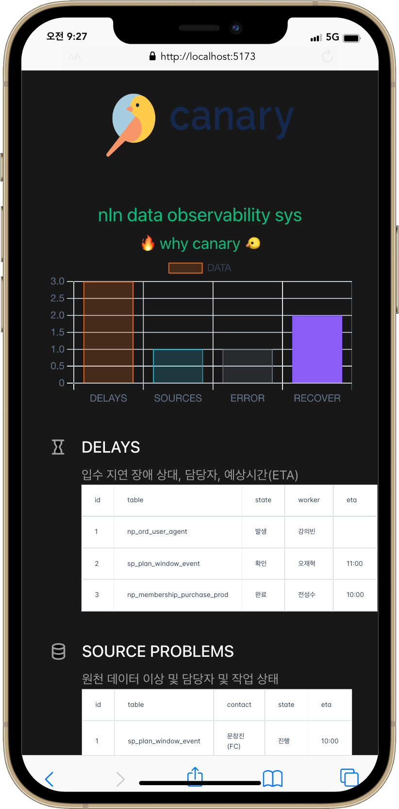
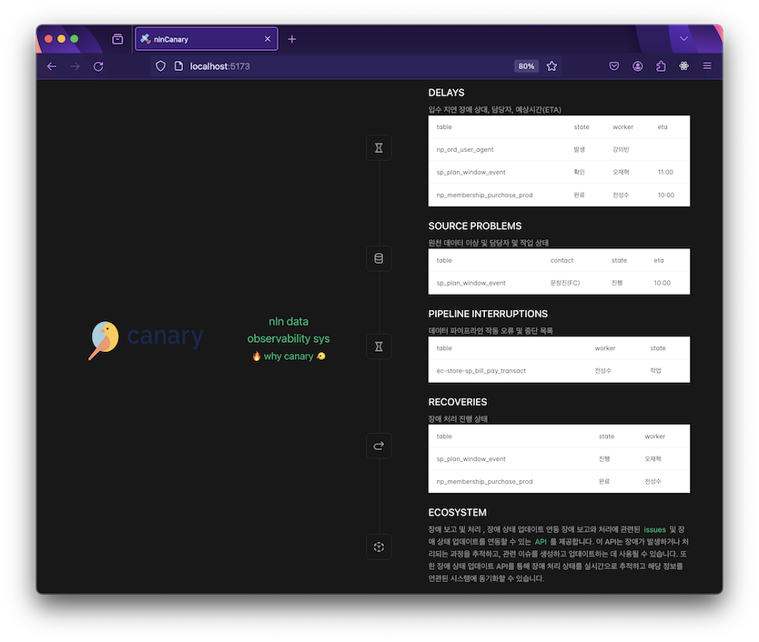

# canary
- https://dev-canary.io.naver.com

## Screenshot



## Architecture
- sidecar is deployed in PRD zones accessible to airflow db
- 나머지 블럭은 도커라이징  n3r(dev) 에 배포
  ```mermaid
  graph LR
  user-->proxy-->
  canary-app-->proxy-->api
  sidecar-->db
  sidecar-->proxy
  mail-sender-->user
  mail-sender-->api
  ```

## System Introduction
```bash
# System Purpose, Features
- 1. 장애시 불필요 커뮤니케이션 비용 절약 - 담당자 및 상태 모바일 업데이트
- 2. 알람 발송 - 기존 파스타 메일 발송 로진 연동
- 3. 장애 목록 히스토리 및 통계 -  

# Module structure, functionality description
- 1. proxy - 캐싱 및 API 라우팅
- 2. canary-app - vuejs FE
- 3. api - json-server curl api 제공
- 3. sidecar - python crontab -> airflow db select, api update, Save daily status snapshot
- 4. mail - 파스타 람다 

# Description data 
- 1. json-server : https://dev-canary-api.io.naver.com/delays & sources, interruptions, recoveries, databoard $ posts (테스트 用)
- 2. mysql : sidecar - docker compose db ( Save daily status snapshot )
```


## Integrated Testing
```bash
$ docker compose -f docker-compose.yml up -d --force-recreate --build
```

## Docker
- https://v2.vuejs.org/v2/cookbook/dockerize-vuejs-app#Real-World-Example
```bash
$ docker build -t canary-fe:0.2.0 .
$ docker run --name c-f-020 -d -p 9020:80 canary-fe:0.2.0
```

## API
- Support Routes (delays, sources, interruptions, recoveries, databoard)
- for testing ➡️ /posts
- rest-api.http ⬅️ Can be run as a file in webstorm
    ```
    GET    /delays
    GET    /delays/:id
    POST   /delays
    PUT    /delays/:id
    PATCH  /delays/:id
    DELETE /delays/:id
    ```

- CRUD & search, sort
    ```bash
    ### INSERT
    # curl -X POST -H "Content-Type: application/json" -d '{ "id": "3", "title": "insert title", "views": 0 }' "https://localhost:7942/api/posts"
    POST http://localhost:7942/api/posts
    Content-Type: application/json
    
    { "id": "3", "title": "insert title", "views": 0 }
    
    ### UPDATE
    # curl -X PATCH -H "Content-Type: application/json" -d '{"views": 1}' http://localhost:7942/api/posts/3
    PATCH http://localhost:7942/api/posts/3
    Content-Type: application/json
    
    {"views": 1}
    
    ### UPDATE
    # curl -X PUT -H "Content-Type: application/json" -d '{"title": "update titel", "views": 1}' http://localhost:7942/api/posts/3
    PUT http://localhost:7942/api/posts/3
    Content-Type: application/json
    
    {"title": "update title", "views": 2}
    
    ###
    # curl -X PUT -H "Content-Type: application/json" -d '{"id": 3, "title": "insert title", "views": 0}' http://localhost:7942/api/posts
    PUT http://localhost:7942/api/posts
    Content-Type: application/json
    
    {"id": "3", "title": "insert title", "views": 0}
    
    ### SELECT ALL
    # curl -X GET -H "Content-Type: application/json" http://localhost:7942/api/delays
    GET http://localhost:7942/api/delays
    Content-Type: application/json
    
    
    ### SELECT ALL ORDER BY ID DESC
    # curl -X GET -H "Content-Type: application/json" http://localhost:7942/api/delays?_sort=-id
    GET http://localhost:7942/api/delays?_sort=-id
    Content-Type: application/json
    
    
    ### SELECT ALL ORDER BY ID DESC
    # curl -X GET -H "Content-Type: application/json" http://localhost:7942/api/delays?state=발생
    GET http://localhost:7942/api/delays?delays?id=1
    Content-Type: application/json
    
    ### SELECT WHERE Conditions
    # lt → <
    # lte → <=
    # gt → >
    # gte → >=
    # ne → !=
    # curl -X GET -H "Content-Type: application/json" http://localhost:7942/api/delays?id=1
    GET http://localhost:7942/api/delays?id=1
    Content-Type: application/json
    
    ### SELECT WHERE Range
    # start
    # end
    # limit
    # curl -X GET -H "Content-Type: application/json" http://localhost:7942/api/delays?_start=1&_end=2_limit=10
    GET http://localhost:7942/api/delays?_start=0&_end=2_limit=1
    Content-Type: application/json
    
    //[
    //  {
    //    "id": "1",
    //    "table": "np_ord_user_agent",
    //    "state": "발생",
    //    "worker": "강의빈",
    //    "eta": ""
    //  },
    //  {
    //    "id": "2",
    //    "table": "sp_plan_window_event",
    //    "state": "확인",
    //    "worker": "오재혁",
    //    "eta": "11:00"
    //  }
    //]
    
    ### DELETE
    # curl -X GET -H "Content-Type: application/json" http://localhost:7942/api/posts/3
    DELETE http://localhost:7942/api/posts/3
    Content-Type: application/json
    ```

## Project Setup
```bash
$ node -v
v20.11.1

npm install
```

### Compile and Hot-Reload for Development
```bash
$ npm run dev
$ npm run dev -- --mode compose
$ npm run dev -- --mode development
$ npm run dev -- --mode production
```

### Compile and Minify for Production
```bash
$ npm run build
```

## Ref
- [Is it possible to change the console font size in IntelliJ IDEA](https://stackoverflow.com/questions/35829103/is-it-possible-to-change-the-console-font-size-in-intellij-idea)
- [vuejs Props are readonly](https://stackoverflow.com/questions/66489055/vuejs-props-are-readonly)
